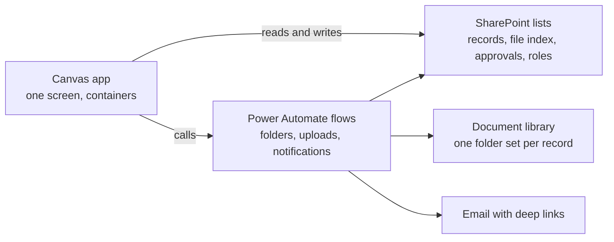

# PowerPlatform.Skills

Task specific agent skills for building canvas Power Apps on SharePoint and Power Automate.
Standard Microsoft 365 licensing, no Dataverse, no premium connectors.

## Why this exists

Internal business apps get built on whatever licence the company already has, and for most
companies that is Microsoft 365 with no Power Platform add on. SharePoint lists instead of
Dataverse. Standard connectors only. No supported source control, because Power Platform Git
Integration requires Dataverse.

Almost everything written about Power Platform assumes the tier above that. So the answer you
find is often the answer for a licence you do not have.

Here is what that looks like. You want the app in git so changes are reviewable. The
documented answer is Git Integration, and it needs Dataverse. The answer available on your
licence is `pac canvas unpack`, which turns the app into readable YAML you can diff and
commit, and packs back cleanly right up until someone adds a people picker or an attachment
form. From that moment packing fails for the whole app and never works again. Both answers
are correct. Only one is available to you, and it decides the order you build in: everything
expressible in YAML lands first, the Studio only controls go in last, in one deliberate batch.

This repo is the second kind of answer, collected in one place. Where something genuinely
needs Dataverse or a premium connector, it says so and gives the standard licence alternative
instead of pretending the ceiling is not there.

Three things follow from working inside a constraint, and together they are the reason to
load these skills rather than point an agent at the official documentation.

**It says do not.** Do not press Reconnect on a dead connection, create a new one and repoint
the reference. Do not put spaces in a SharePoint column name. Do not let a step transition
create approval rows. Do not pack an app past the door. Vendor documentation rarely calls a
feature a trap, because it has to support every feature it ships. Knowing which door not to
open is the part you cannot get from a reference.

**It is organized around silent failure.** Most of what goes wrong here does not error. A
pasted people picker searches the wrong field and still opens, still lets you pick a person,
and simply never matches what you type. A filter that cannot fold computes over the first 500
rows and returns a confident wrong count. `pac solution import` without `--async` prints
nothing at all, which reads as a hang. A clean pack is not a clean app. That matters more when
an agent is writing the code, because an agent reading the documentation produces something
plausible that fails quietly, and plausible is what gets through review.

**It has defaults.** One screen with containers as views. One list shape to start from. One
theme record every control reads. One naming convention. Official guidance cannot ship
opinions, so it ships "it depends", and an agent facing "it depends" invents one. A stated
default is what stops the invention.

Everything here assumes standard Microsoft 365 licensing. If that is what you are working
with, this was written for you, and those limits are the starting point for every answer in it
rather than a caveat at the end of one.

## The skills

| Skill | What it does | Example trigger |
|---|---|---|
| [`powerapps-build-playbook`](skills/powerapps-build-playbook/SKILL.md) | The phase order for a whole build, the map of what is code versus what is clicks, manual step specs, and how to wire an AI assistant in. Start here. | "build a new power app", "where do I start", "what do I click" |
| [`powerapps-source-workflow`](skills/powerapps-source-workflow/SKILL.md) | pa.yaml, pack and unpack, the one way door (PA2108), pac auth, solutions, and the app repo layout. | "unpack the msapp", "pack fails", "PA2108" |
| [`powerapps-sharepoint-data`](skills/powerapps-sharepoint-data/SKILL.md) | List design as the database. The standard list shape, naming, column types, delegation, and the schema contract doc. | "design my SharePoint lists", "delegation warning" |
| [`powerapps-architecture-and-ui`](skills/powerapps-architecture-and-ui/SKILL.md) | The single screen shell, OnStart and OnVisible, naming, and the proven UI patterns: steppers, gates, shared panels, dashboards. | "add a panel", "build a stepper", "OnStart" |
| [`powerapps-powerfx`](skills/powerapps-powerfx/SKILL.md) | Every Power Fx formula, and the non negotiable rules written as wrong versus right code. | "my Power Fx has an error", "patch is not saving" |
| [`powerapps-approvals-and-flows`](skills/powerapps-approvals-and-flows/SKILL.md) | The approval engine with cycles and returns, the two layer access model, flow JSON, and the proven flow shapes. | "add an approval", "permissions", "write the flow" |
| [`powerapps-troubleshooting`](skills/powerapps-troubleshooting/SKILL.md) | Error to cause to fix, everything that actually broke. | any pasted error message |

## The shape of what you can build



A record moves through numbered steps with required fields and required evidence, approvers
sign off row by row with full cycle history, every record gets its own folder, and finished
records lock read only. All of it on standard Microsoft 365 licensing.

## Install

The skills follow the Agent Skills standard (a `SKILL.md` with `name` and `description`
frontmatter plus a `references/` folder), which is an open format, not a Claude one. Any tool
that reads skills picks these up, and any tool that does not can still read them as plain
markdown. Each skill folder is self contained: copy it alone and nothing breaks.

### Claude Code

This repo is a Claude Code plugin. It works anywhere you run Claude Code: the CLI, the VS Code
or JetBrains extension, and the desktop app. The repo is public, so anyone can install it on
any Claude plan.

Terminal, the reliable way that works in every setup:

```
claude plugin marketplace add FoldMyJeans/PowerPlatform.Skills
claude plugin install powerplatform-skills@powerplatform-skills
```

Run those from a project folder, not your home directory. A git safety check can otherwise
refuse to clone. Then `claude plugin list` should show `powerplatform-skills` as enabled.
Restart your Claude Code session so the skills load.

Inside a Claude Code chat session, the interactive form also works:

```
/plugin marketplace add FoldMyJeans/PowerPlatform.Skills
/plugin install powerplatform-skills@powerplatform-skills
```

The `/plugin` command is not available in every surface (the desktop app hides it), so use the
terminal commands above if you do not see it. Update later with
`claude plugin update powerplatform-skills` (or `/plugin update` in chat).

### Codex, Cursor, and other agents that read ~/.agents/skills

Codex, Cursor, and a growing number of other agents read skills from `~/.agents/skills/`.
Clone the repo, copy the skill folders there once, and they get picked up.

PowerShell (Windows):

```
git clone https://github.com/FoldMyJeans/PowerPlatform.Skills
Copy-Item -Recurse -Force PowerPlatform.Skills/skills/* ~/.agents/skills/
```

macOS or Linux:

```
git clone https://github.com/FoldMyJeans/PowerPlatform.Skills
mkdir -p ~/.agents/skills && cp -R PowerPlatform.Skills/skills/* ~/.agents/skills/
```

To update: `git pull` in the clone, then run the copy again. Every skill folder is self
contained, so copying only the skills you want also works.

For project scoped use instead of user wide, copy the skill folders into the project's
`.agents/skills/` folder, which these tools also discover.

### Any other AI tool

There is nothing proprietary here. A skill is a folder of markdown, so anything that can read
markdown can use it, with or without skill support.

If the tool can browse or fetch a URL, give it the repo link and tell it which skill to read,
for example `skills/powerapps-powerfx/SKILL.md`. If it cannot, open that `SKILL.md`, paste it
in, and paste whichever file under `references/` it points you to.

Grab one skill, not the set. The whole repo is around 43,000 tokens and will crowd out a chat
window. A single `SKILL.md` plus one reference is closer to 2,000 to 4,000, which fits
anywhere. The skills table above tells you which one you want.

What you lose without skill support is only the automatic part. A skill aware tool notices you
asked about a pack failure and loads the right file on its own. Everywhere else you pick the
file yourself, and the content is identical.

### Native alternatives

- Codex: the `$skill-installer` skill can be prompted with this repo's URL to fetch skills.
- Cursor: Customize, Rules, Add Rule, Remote Rule (GitHub) accepts this repo's URL, and Cursor
  also discovers `.cursor/skills/`.

The clone and copy method above is the one to reach for by default. Use these if you prefer
them.

## Authoring changes

To add or change a skill, edit under `skills/` on a branch and open a pull request. Bump the
`version` in `.claude-plugin/plugin.json` so installed copies pick it up on the next
`/plugin update`. See AGENTS.md for the writing rules and the standard licence lens.

Before committing, run the check script. It enforces the writing rules, the file size caps,
the self containment rule, and redaction:

```
pwsh -File tools\check.ps1
```

## Keep it local

Do not put this repo inside a OneDrive synced folder. Git plus OneDrive in one folder can
corrupt the repo.

## A note on what is here

The canvas source workflow (`pac canvas pack` and `unpack`) is a deprecated preview feature
and a one way door. The `powerapps-source-workflow` skill explains exactly where it breaks and
how to work after it does, rather than pretending it is not there.

The examples use a fictional deal review app (`Deals`, `Approvals`, `Role_Config`, `varDeal`)
so every formula reads concretely, and every skill writes against that same schema so an
example copied from one binds in another. Swap the nouns for your process.

Everything here earned its place on a real build. When you learn something the hard way, add
it. When something here goes stale, fix it.
